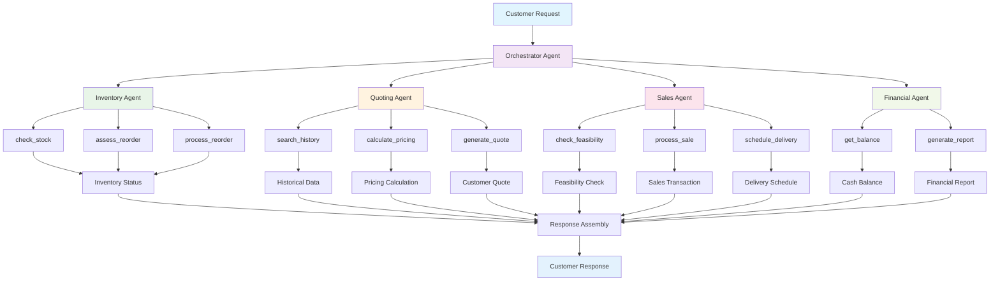

# Beaver's Choice Paper Company - Multi-Agent System Workflow Diagram

## System Architecture Overview

## Agent Responsibilities and Tools

### 1. Orchestrator Agent
**Primary Role**: Main coordinator and workflow manager
**Tools**:
- `parse_customer_request()`: Extracts items and quantities using regex patterns
- `process_customer_request()`: Orchestrates the entire workflow

### 2. Inventory Agent
**Primary Role**: Stock management and reorder assessment
**Tools**:
- `check_stock()` → Uses `get_stock_level()`: Check current stock for specific items
- `get_inventory_overview()` → Uses `get_all_inventory()`: Complete inventory snapshot
- `assess_reorder_needs()` → Uses `get_supplier_delivery_date()`: Calculate delivery timelines
- `process_reorder()` → Uses `create_transaction()`: Execute stock purchase orders

### 3. Quoting Agent
**Primary Role**: Quote generation and pricing strategy
**Tools**:
- `search_quote_history()` → Uses `search_quote_history()`: Find similar historical quotes
- `calculate_pricing()` → Uses `get_all_inventory()` + custom logic: Apply bulk discounts
- `generate_quote()` → Custom pricing engine: Create comprehensive customer quotes

### 4. Sales Agent
**Primary Role**: Transaction processing and delivery management
**Tools**:
- `check_sales_feasibility()` → Uses `get_stock_level()`: Verify inventory availability
- `calculate_delivery_schedule()` → Uses `get_supplier_delivery_date()`: Determine delivery timelines
- `process_sale()` → Uses `create_transaction()`: Execute sales transactions

### 5. Financial Agent
**Primary Role**: Financial reporting and cash flow monitoring
**Tools**:
- `get_financial_report()` → Uses `generate_financial_report()`: Comprehensive financial analysis
- `get_cash_balance()` → Uses `get_cash_balance()`: Monitor current cash position

## Data Flow and Interactions

### Request Processing Flow:
1. **Customer Request** → Orchestrator Agent parses and extracts items
2. **Inventory Check** → Inventory Agent verifies stock levels
3. **Quote Generation** → Quoting Agent calculates pricing with discounts
4. **Sales Feasibility** → Sales Agent checks if order can be fulfilled
5. **Transaction Processing** → Sales Agent executes the sale
6. **Financial Update** → Financial Agent updates cash and inventory
7. **Response Assembly** → Orchestrator Agent compiles final response

### Tool Interactions:
- **Database Operations**: All agents use helper functions to interact with SQLite database
- **Data Sharing**: Agents pass structured data between each other
- **Error Handling**: Each agent handles failures gracefully
- **State Management**: System maintains consistent state across all operations

## Helper Functions Utilization

All required helper functions from the starter code are utilized:

1. **`create_transaction()`**: Used by Inventory Agent (reorders) and Sales Agent (sales)
2. **`get_all_inventory()`**: Used by Quoting Agent and Inventory Agent
3. **`get_stock_level()`**: Used by Inventory Agent and Sales Agent
4. **`get_supplier_delivery_date()`**: Used by Inventory Agent and Sales Agent
5. **`get_cash_balance()`**: Used by Financial Agent
6. **`generate_financial_report()`**: Used by Financial Agent
7. **`search_quote_history()`**: Used by Quoting Agent

## Decision-Making Process

The architecture was designed based on:
1. **Separation of Concerns**: Each agent has distinct, non-overlapping responsibilities
2. **Scalability**: Modular design allows easy addition of new agents
3. **Maintainability**: Clear interfaces between agents
4. **Reliability**: Error handling at each level
5. **Performance**: Efficient data flow and minimal redundancy 