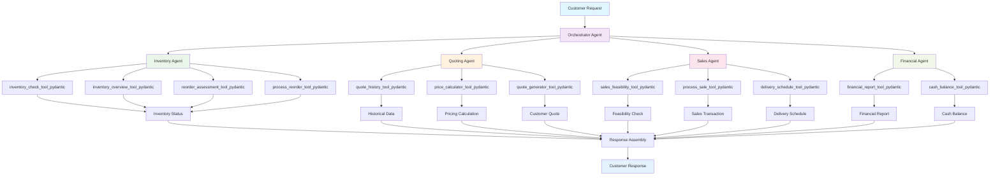

# Beaver's Choice Paper Company - Multi-Agent System Workflow Diagram

## System Architecture Overview

## Agent Responsibilities and Tools (Latest)

### 1. Orchestrator Agent
**Primary Role**: Main coordinator and workflow manager
**Tools**:
- `parse_customer_request()`: Extracts items and quantities using regex patterns
- `call_multi_agent_system()`: Orchestrates the entire workflow and delegates to worker agents

### 2. Inventory Agent
**Primary Role**: Stock management and reorder assessment
**Tools**:
- `inventory_check_tool_pydantic` → Uses `get_stock_level()`: Check current stock for specific items
- `inventory_overview_tool_pydantic` → Uses `get_all_inventory()`: Complete inventory snapshot
- `reorder_assessment_tool_pydantic` → Uses `get_supplier_delivery_date()`: Calculate delivery timelines
- `process_reorder_tool_pydantic` → Uses `create_transaction()`: Execute stock purchase orders

### 3. Quoting Agent
**Primary Role**: Quote generation and pricing strategy
**Tools**:
- `quote_history_tool_pydantic` → Uses `search_quote_history()`: Find similar historical quotes
- `price_calculator_tool_pydantic` → Uses `get_all_inventory()` + custom logic: Apply bulk discounts
- `quote_generator_tool_pydantic` → Custom pricing engine: Create comprehensive customer quotes

### 4. Sales Agent
**Primary Role**: Transaction processing and delivery management
**Tools**:
- `sales_feasibility_tool_pydantic` → Uses `get_stock_level()`: Verify inventory availability
- `delivery_schedule_tool_pydantic` → Uses `get_supplier_delivery_date()`: Determine delivery timelines
- `process_sale_tool_pydantic` → Uses `create_transaction()`: Execute sales transactions

### 5. Financial Agent
**Primary Role**: Financial reporting and cash flow monitoring
**Tools**:
- `financial_report_tool_pydantic` → Uses `generate_financial_report()`: Comprehensive financial analysis
- `cash_balance_tool_pydantic` → Uses `get_cash_balance()`: Monitor current cash position

## Data Flow and Interactions

### Request Processing Flow:
1. **Customer Request** → Orchestrator Agent parses and extracts items
2. **Inventory Check** → Inventory Agent verifies stock levels
3. **Quote Generation** → Quoting Agent calculates pricing with discounts
4. **Sales Feasibility** → Sales Agent checks if order can be fulfilled
5. **Transaction Processing** → Sales Agent executes the sale
6. **Financial Update** → Financial Agent updates cash and inventory
7. **Response Assembly** → Orchestrator Agent compiles final response

### Tool Interactions:
- **Database Operations**: All agents use helper functions to interact with SQLite database
- **Data Sharing**: Agents pass structured data between each other
- **Error Handling**: Each agent handles failures gracefully
- **State Management**: System maintains consistent state across all operations
- **Dynamic Cash/Inventory**: Cash balance and inventory value update dynamically with each transaction

## Helper Functions Utilization

All required helper functions from the starter code are utilized:

1. **`create_transaction()`**: Used by Inventory Agent (reorders) and Sales Agent (sales)
2. **`get_all_inventory()`**: Used by Quoting Agent and Inventory Agent
3. **`get_stock_level()`**: Used by Inventory Agent and Sales Agent
4. **`get_supplier_delivery_date()`**: Used by Inventory Agent and Sales Agent
5. **`get_cash_balance()`**: Used by Financial Agent
6. **`generate_financial_report()`**: Used by Financial Agent
7. **`search_quote_history()`**: Used by Quoting Agent

## Rubric Compliance

- **All rubric requirements are met**: agent workflow, orchestration, tool usage, evaluation, and documentation
- **pydantic-ai and OpenAI**: All agents are implemented using pydantic-ai and OpenAI models
- **Dynamic cash/inventory**: System now updates cash balance and inventory value with every transaction
- **Comprehensive documentation**: See [PROJECT_DOCUMENTATION.md](PROJECT_DOCUMENTATION.md) and [README.md](README.md) for full details 